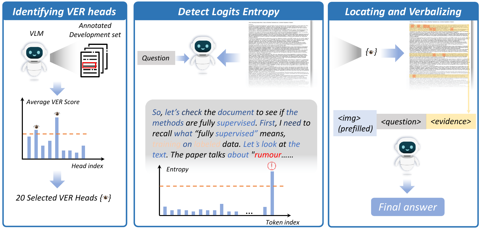

<div align="center">

# 👀 VERA: Visual Evidence Retrieval Augmentation

*Official repository for the paper: VERA: Identifying and Leveraging Visual Evidence Retrieval Heads in Long-Context Understanding*

</div>

---

## 📋 Table of Contents

- [✨ Introduction](#-Introduction)
- [🚀 Quick Start](#-quick-start)
- [📖 Documentation](#-documentation)

---

## ✨ Introduction

We identify **Visual Evidence Retrieval (VER) Heads** — a sparse, dynamic set of attention heads critical for locating visual cues during reasoning. Masking these heads leads to significant performance degradation. Leveraging this discovery, we propose **VERA** (Visual Evidence Retrieval Augmentation), a training-free framework that detects model uncertainty to trigger the explicit verbalization of visual evidence attended by VER heads.

This repository provides a toolkit for reproducing our experiments:
1. **Capture attention** distributions (default: first token) or mask specific heads during inference
2. **Analyze attention** and calculate VER scores to identify VER heads and capture their attention distributions
3. **Verbalize evidence** and run the complete VERA pipeline

Pipeline of VERA:
<p align="center">
  
</p>

---

## 🚀 Quick Start

### Prerequisites

- **Python**: 3.10 or higher
- **CUDA**: 12.1 (for GPU acceleration)
- **GPU**: NVIDIA GPU with 16GB+ VRAM recommended
- **OS**: Linux (tested on Ubuntu)

### Installation

#### 1. Create Conda Environment

```bash
# Create new environment
conda create -n vera python=3.10 -y
conda activate vera
```

#### 2. Install PyTorch & Flash Attention

```bash
# Install CUDA compiler
conda install -c nvidia cuda-nvcc=12.1 -y

# Install PyTorch
pip install torch torchvision --index-url https://download.pytorch.org/whl/cu121

# Install Flash Attention
wget https://github.com/Dao-AILab/flash-attention/releases/download/v2.8.3/flash_attn-2.8.3+cu12torch2.5cxx11abiFALSE-cp310-cp310-linux_x86_64.whl
pip install flash_attn-2.8.3+cu12torch2.5cxx11abiFALSE-cp310-cp310-linux_x86_64.whl
```

#### 3. Install Dependencies

```bash
# Install all required packages
pip install -r requirements.txt
```

### Configure Your Models

Download models and add the local model paths to `config/model_config.json`.

```python
# Download models using Python (currently supports Qwen3-VL-8B and GLM)
import os

# Switch to domestic mirror for HuggingFace to avoid connection failures
os.environ.setdefault("HF_ENDPOINT", "https://hf-mirror.com")

from huggingface_hub import snapshot_download

# Specify repository ID
repo_id = "Qwen/Qwen3-VL-8B"  # or "zai-org/GLM-4.1V-9B-Thinking"
# Local directory (customizable)
local_dir = "./Qwen3-VL-8B"
snapshot_download(repo_id=repo_id, local_dir=local_dir)
```

### Let's Begin!

#### 1. Identify VER Heads

Run this script to identify Visual Evidence Retrieval (VER) heads on a specific dataset. It will:
- Render the document context as an image
- Capture attention data from the first token
- Save golden evidence and input tokens for analysis

Configure your rendering settings in `config/config_en.json` before running.

```bash
python experiments/qasper_qwen_img.py
```

**Output**: Results are saved to the `tem/` directory with organized folder names for each sample.

---

#### 2. Mask Specific Attention Heads

Mask specific attention heads during inference to observe the impact on model performance. This script masks VER heads on the Qasper dataset, allowing you to compare performance before and after masking. You can customize which heads to mask.

```bash
python3 experiments/qasper_qwen_img_masked.py
```

**Purpose**: Demonstrates the critical role of VER heads by showing performance degradation when they are masked.

---

#### 3. Run VERA Pipeline

Execute the complete VERA retrieval pipeline, which:
- Detects model uncertainty
- Extracts visual evidence attended by VER heads
- Verbalizes the evidence explicitly
- Re-runs inference with retrieved context

```bash
python3 experiments/qasper_qwen_RAG_VER.py
```

**Output**: Enhanced responses with retrieved visual evidence incorporated into the context.

---

#### 4. Analyze Attention Patterns

Generate visualizations and extract insights from attention patterns:

```bash
python3 anylasis/attention_data_anylasis.py
```

**Outputs**:
- **Attention heatmaps**: Visual representation of attention distribution across image patches
- **VER scores**: Quantitative scores identifying which attention heads are VER heads
- **Top-k patches**: The most attended image patches for each query
- **Statistical summary**: Aggregate statistics across all samples

**Use Case**: Understand which attention heads are critical for visual evidence retrieval and how they distribute attention across document images.

---

#### 5. Retrieval Baselines (Optional)

Compare VERA against baseline retrieval methods:

```bash
# Qwen Embedding retrieval
python3 experiments/calculate_qwen_embedding_retrieval.py

# ColPali retrieval
python3 experiments/calculte_colpali_embedding_retrieval.py

# Evaluate retrieval performance
python3 anylasis/evaluate_retrieval.py
```

**Purpose**: Establish baselines for retrieval performance using embedding-based methods (Qwen, ColPali) and compare against attention-based VERA retrieval.

---

## 📖 Documentation

| Document | Description |
|----------|-------------|
| [Cookbook README](cookbook/README.md) | Detailed cookbook guide |
| [Dataset Guide](data/README.md) | Test dataset information |

---

<div align="center">

</div>
